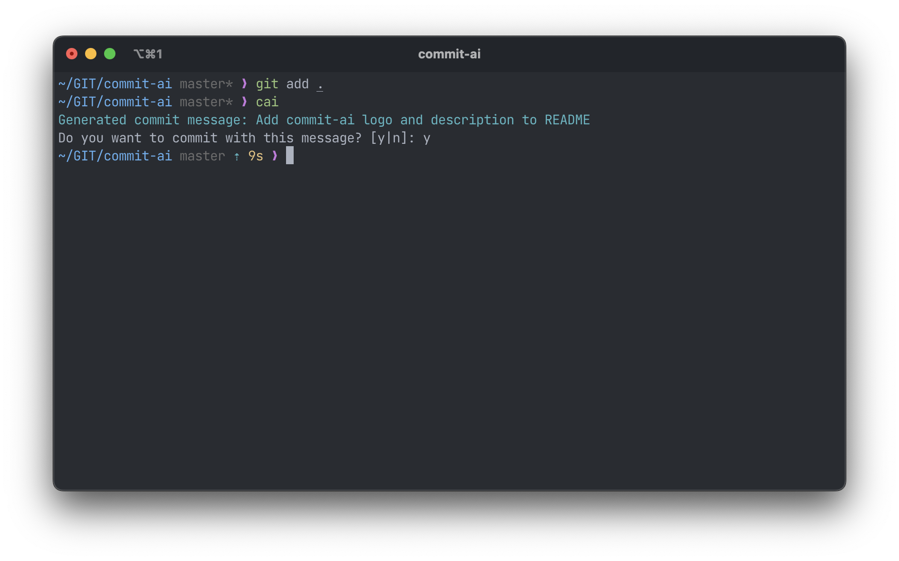

<div align="center">
  <div>
    
    <h1 align="center">commit-ai</h1>
  </div>
</div>

commit-ai is an open-source project written in Go that uses OpenAI to generate descriptive commit messages based off your git diff.

### Why?
Because who has time to remember what you did in that code 2 minutes ago.

## Install
Install from brew:
```shell
brew tap TomByte/homebrew-cai
brew install cai
```

## Environment Variables
The only required environment variable is:
```shell
export OPENAI_KEY=xxxx
```
Replace `xxxx` with your OpenAI key, you can get from [OpenAI](https://platform.openai.com/account/api-keys). You can either set this in your shell rc file (e.g `.zshrc`) or just export for your current session.

## Run
To run commit-ai, you can use the following command in a GIT repository:
```shell
cai
```

## Run From Source
To run the project, you can use the following command:
```shell
go run .
```

## Build From Source
To build the project, you will need to have Go installed on your machine. You can then run the following command in your terminal:

## Test
To run tests, you can use the following command:

```shell
go test
```

This will run all the tests in the project and output the results to the terminal.

## Credits
Massively inspired by [Nutlope/aicommits](https://github.com/Nutlope/aicommits).

## Todo
- [ ] Add tests
- [ ] Fix 2000 character limit on diff
- [ ] Configurable excludes from diff
- [ ] Config-file powered config
- [x] Add to brew

## Contributing
If you would like to contribute to the "commit-ai" project, please fork the repository and submit a pull request. We welcome contributions of all kinds, from bug fixes to new features.

## License
"commit-ai" is released under the MIT license.